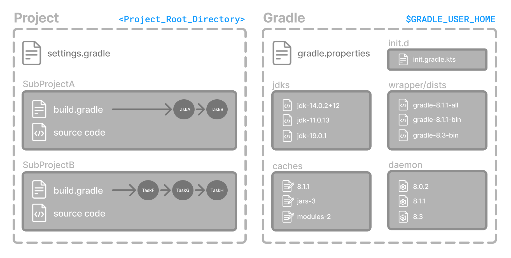
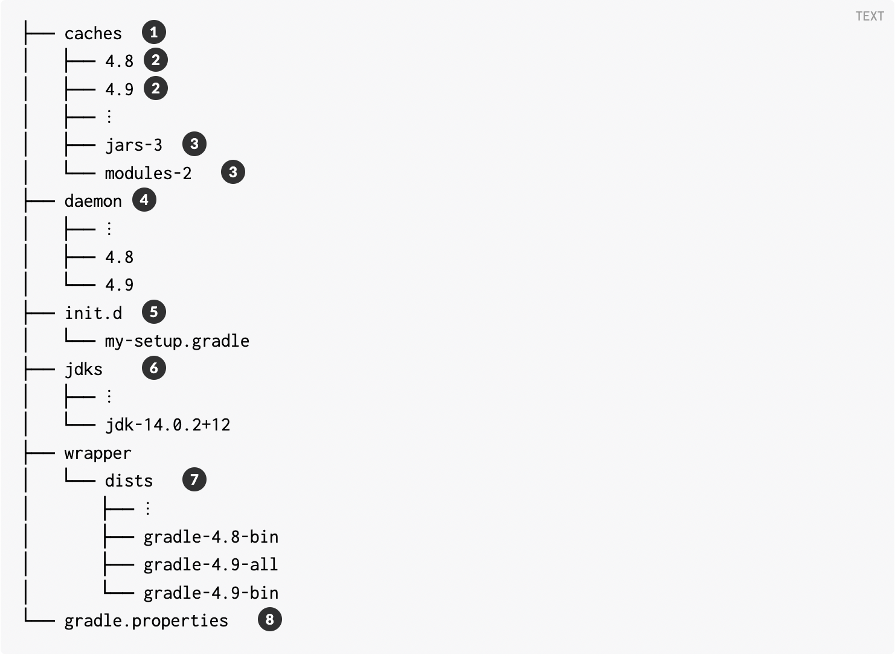
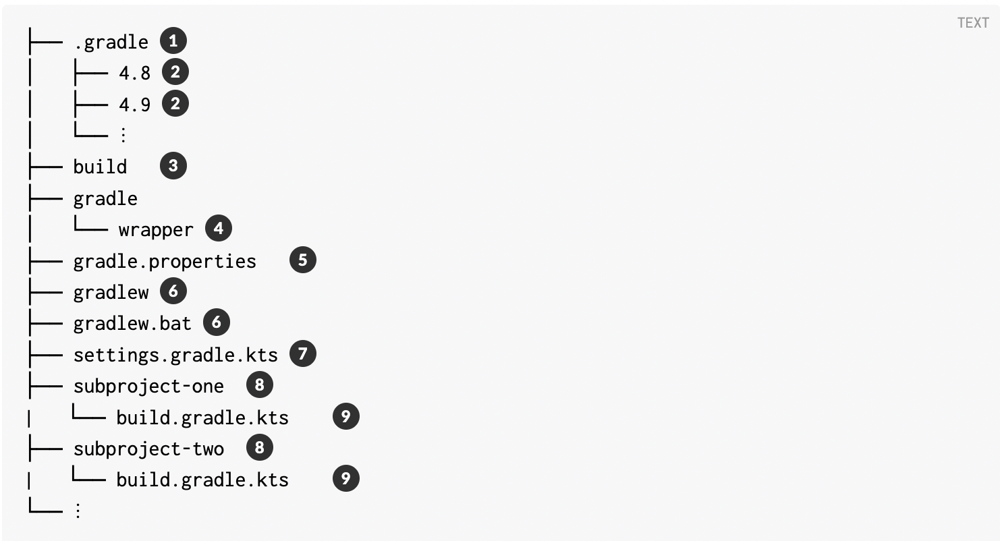

# Gradle Knowledge

## Gradle Directories
Gradle uses two main directories to perform and manage its work: the Gradle User Home directory and the Project Root directory.

### [Gradle User Home Directory](https://docs.gradle.org/current/userguide/gradle_directories.html#gradle_user_home)

By default, the Gradle User Home (~/.gradle or C:\Users\<USERNAME>\.gradle) stores global configuration properties, initialization scripts, caches, and log files.

It can be set with the environment variable **GRADLE_USER_HOME**.

> **TIP:** 
> Not to be confused with the **GRADLE_HOME**, the optional installation directory for Gradle.

It is roughly structured as follows:

1. Global cache directory (for everything that is not project-specific).
2. Version-specific caches (e.g., to support incremental builds).
3. Shared caches (e.g., for artifacts of dependencies).
4. Registry and logs of the Gradle Daemon.
5. Global initialization scripts.
6. JDKs downloaded by the toolchain support.
7. Distributions downloaded by the Gradle Wrapper.
8. Global Gradle configuration properties.

Source: https://docs.gradle.org/current/userguide/gradle_directories.html#gradle_user_home

#### Project Root Directory

The project root directory contains all source files from your project.

It also contains files and directories Gradle generates, such as `.gradle` and `build`, as well as the Gradle configuration directory: `gradle`.

> **TIP:** 
> gradle and .gradle directories are different.

  

> **NOTE:** 
> Project root directory will have files generated by the Gradle execution tasks.  `.gradle` and `build` are two directories which will be generated by these tasks.  The files contained within these directories will also be generated by the gradle task executions.  
> PROMOTE SOFTWARE DEVELOPMENT EFFICIENCIES BY ASSERTING THE ORGANIZATION'S APPLICATION CONTROLS HAVE WHITELISTED THE FILES RESIDING WITHIN THESE DIRECTORIES ACCORDINGLY

While gradle is usually checked into source control, build and .gradle directories contain the output of your builds, caches, and other transient files Gradle uses to support features like incremental builds.

The anatomy of a typical project root directory looks as follows:

1. Project-specific cache directory generated by Gradle.
2. Version-specific caches (e.g., to support incremental builds).
3. The build directory of this project into which Gradle generates all build artifacts.
4. Contains the JAR file and configuration of the Gradle Wrapper.
5. Project-specific Gradle configuration properties.
6. Scripts for executing builds using the Gradle Wrapper.
7. The project’s settings file where the list of subprojects is defined.
8. Usually, a project is organized into one or multiple subprojects.
9. Each subproject has its own Gradle build script.

## Additional Reading
[User Guide](https://docs.gradle.org/current/userguide/)
[Upgrading To Gradle V8](https://docs.gradle.org/current/userguide/upgrading_version_8.html#minimum_daemon_jvm_version)

Tasks:
- Create driver with esb api
- Assign carrier to badge and driver.

- Manually create driver
- Assign carrier to badge and driver.
- Create driver with esb api
- Demonstrate the results when we delete carrier assignments if badge is assigned to cpam person and carrier assignment's badge is assigned to manually created driver.

- Demonstrate the results when we reassign carrier assignments if badge is assigned to cpam person and carrier assignment's badge is assigned to manually created driver.

